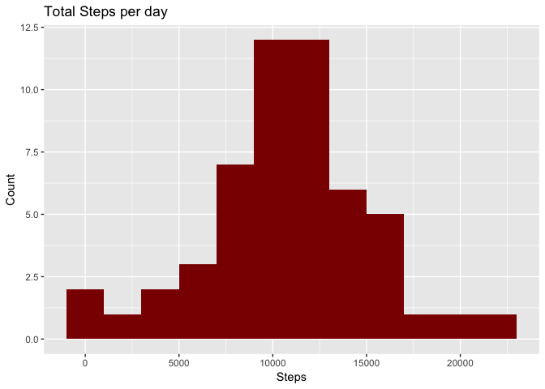
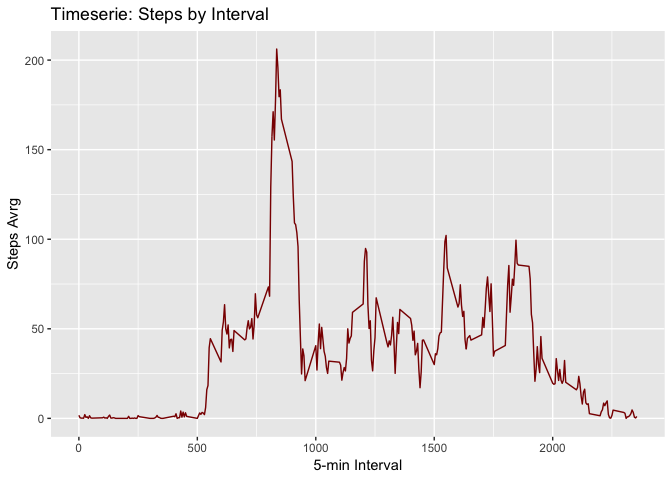
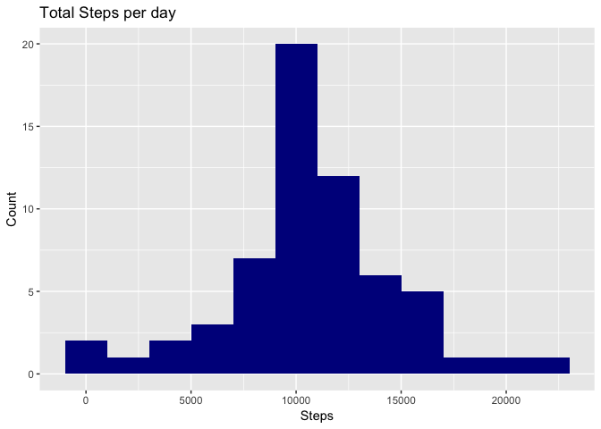
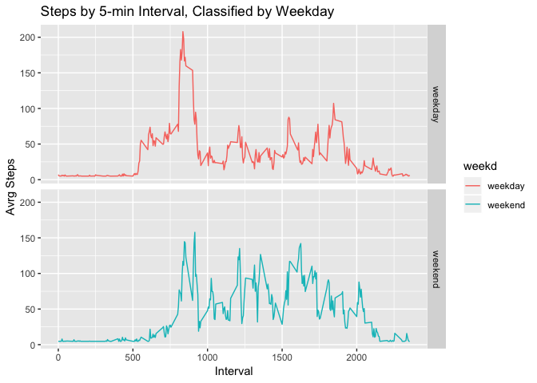

Author: I. Diaz

## Loading and preprocessing the data

Information is zipped into a file, so first is necesary to unzip the data and then save de dataset.

```r
#unzip de file
unzip("activity.zip")

#saving dataset as "dataset"
dataset <- read.csv("activity.csv")
head(dataset)
```

```
##   steps       date interval
## 1    NA 2012-10-01        0
## 2    NA 2012-10-01        5
## 3    NA 2012-10-01       10
## 4    NA 2012-10-01       15
## 5    NA 2012-10-01       20
## 6    NA 2012-10-01       25
```

```r
summary(dataset)
```

```
##      steps                date          interval     
##  Min.   :  0.00   2012-10-01:  288   Min.   :   0.0  
##  1st Qu.:  0.00   2012-10-02:  288   1st Qu.: 588.8  
##  Median :  0.00   2012-10-03:  288   Median :1177.5  
##  Mean   : 37.38   2012-10-04:  288   Mean   :1177.5  
##  3rd Qu.: 12.00   2012-10-05:  288   3rd Qu.:1766.2  
##  Max.   :806.00   2012-10-06:  288   Max.   :2355.0  
##  NA's   :2304     (Other)   :15840
```

Setting date column to date format

```r
dataset$date <- as.Date(as.character(dataset$date), format = "%Y-%m-%d")
head(dataset)
```

```
##   steps       date interval
## 1    NA 2012-10-01        0
## 2    NA 2012-10-01        5
## 3    NA 2012-10-01       10
## 4    NA 2012-10-01       15
## 5    NA 2012-10-01       20
## 6    NA 2012-10-01       25
```

Exploring data without NAs

```r
datasetna <- dataset[complete.cases(dataset),]
head(datasetna)
```

```
##     steps       date interval
## 289     0 2012-10-02        0
## 290     0 2012-10-02        5
## 291     0 2012-10-02       10
## 292     0 2012-10-02       15
## 293     0 2012-10-02       20
## 294     0 2012-10-02       25
```

## What is mean total number of steps taken per day?
First of all, I'll aggregate datasetna by summing steps by date and save the results to "aggdata"  in order to prepare de data to build a histogra and calculate de mean and median.

```r
aggdata <- aggregate(steps ~ date, data = datasetna, FUN = sum)
head(aggdata, 10)
```

```
##          date steps
## 1  2012-10-02   126
## 2  2012-10-03 11352
## 3  2012-10-04 12116
## 4  2012-10-05 13294
## 5  2012-10-06 15420
## 6  2012-10-07 11015
## 7  2012-10-09 12811
## 8  2012-10-10  9900
## 9  2012-10-11 10304
## 10 2012-10-12 17382
```

Ploting a histogram


```r
library(ggplot2)
hist1 <- ggplot(aggdata, aes(x = steps)) + geom_histogram(fill = "darkred", binwidth=2000) + labs(title = "Total Steps per day", x = "Steps", y = "Count")

hist1
```

<!-- -->

Calculating the mean and median

```r
paste("the mean is ", mean(aggdata$steps))
```

```
## [1] "the mean is  10766.1886792453"
```

```r
paste("the median is ", median(aggdata$steps))
```

```
## [1] "the median is  10765"
```

## What is the average daily activity pattern?
In order to get the data prepared and build the timeserie is necesary to get the average of steps by intervale. I've used the aggregate function to have this.

```r
avrgsteps <- aggregate(steps ~ interval, data = datasetna, FUN = mean)
head(avrgsteps, 10)
```

```
##    interval     steps
## 1         0 1.7169811
## 2         5 0.3396226
## 3        10 0.1320755
## 4        15 0.1509434
## 5        20 0.0754717
## 6        25 2.0943396
## 7        30 0.5283019
## 8        35 0.8679245
## 9        40 0.0000000
## 10       45 1.4716981
```

Build the time series using

```r
timeserie <- ggplot(avrgsteps, aes(x = interval, y = steps)) + geom_line(color = "darkred") + labs(title = "Timeserie: Steps by Interval", x = "5-min Interval", y = "Steps Avrg")

timeserie
```

<!-- -->

To calculate the max value I'll use de previous set "avrgsteps" I created, because it contains the average number of step for every 5-min interval.


```r
avrgsteps[which(avrgsteps$steps == max(avrgsteps$steps)),]
```

```
##     interval    steps
## 104      835 206.1698
```

## Imputing missing values
Accordingly to the summary function previously used to the original dataset, the number of NAs is 2304.

I'll try to process the empty values in order to check if this take effect to the final result. NAs will be replace with the mean.

```r
#calculating the mean value
meanvalue <- mean(datasetna$steps)
meanvalue
```

```
## [1] 37.3826
```

```r
#replacing NAs with the mean in the "steps" column
datasetnona <- dataset
nas <- is.na(dataset$steps)
datasetnona$steps[nas] <- meanvalue
summary(datasetnona)
```

```
##      steps             date               interval     
##  Min.   :  0.00   Min.   :2012-10-01   Min.   :   0.0  
##  1st Qu.:  0.00   1st Qu.:2012-10-16   1st Qu.: 588.8  
##  Median :  0.00   Median :2012-10-31   Median :1177.5  
##  Mean   : 37.38   Mean   :2012-10-31   Mean   :1177.5  
##  3rd Qu.: 37.38   3rd Qu.:2012-11-15   3rd Qu.:1766.2  
##  Max.   :806.00   Max.   :2012-11-30   Max.   :2355.0
```

Build a histogram

```r
aggdata2 <- aggregate(steps ~ date, data = datasetnona, FUN = sum)
hist2 <- ggplot(aggdata2, aes(x = steps)) + geom_histogram(fill = "darkblue", binwidth=2000) + labs(title = "Total Steps per day", x = "Steps", y = "Count")

hist2
```

<!-- -->

Calculate the mean and the median of the de data aggregated


```r
paste("the mean is ", mean(aggdata2$steps))
```

```
## [1] "the mean is  10766.1886792453"
```

```r
paste("the median is ", median(aggdata2$steps))
```

```
## [1] "the median is  10766.1886792453"
```

If we see there is no significant impact of the in the values repect the original dataset, just in case of the median because of the 2304 NAs that not exist anymore and center value changed.

## Are there differences in activity patterns between weekdays and weekends?

I'll create a new variable call "weekd" and call the weekday using the weekday() function. Then if weekd is not weekend store 1 in the "weekdclasif" variable and 0 if it's weekend. 

```r
datasetnona2 <- datasetnona
datasetnona2["weekd"] <- weekdays(datasetnona2$date)
# assign weekdays to 1 and weekend to 0 and save the values to "weekdclasif"
datasetnona2$weekdclasif <- ifelse(datasetnona2$weekd == "Saturday"  | datasetnona2$weekd == "Sunday", "weekend", "weekday")
tail(datasetnona2,5)
```

```
##         steps       date interval  weekd weekdclasif
## 17564 37.3826 2012-11-30     2335 Friday     weekday
## 17565 37.3826 2012-11-30     2340 Friday     weekday
## 17566 37.3826 2012-11-30     2345 Friday     weekday
## 17567 37.3826 2012-11-30     2350 Friday     weekday
## 17568 37.3826 2012-11-30     2355 Friday     weekday
```

Is necessary to prepare the dataset and then build the plot in order to compare how is the variation of the steps on weekdays and weekend.

```r
aggdata3 <- aggregate(datasetnona2$steps, by=list(datasetnona2$weekdclasif, datasetnona2$interval), mean)
names(aggdata3)[1]  = "weekd"
names(aggdata3)[2] = "interval"
names(aggdata3)[3] = "meansteps"

head(aggdata3)
```

```
##     weekd interval meansteps
## 1 weekday        0  7.006569
## 2 weekend        0  4.672825
## 3 weekday        5  5.384347
## 4 weekend        5  4.672825
## 5 weekday       10  5.139902
## 6 weekend       10  4.672825
```
Buils de plot using ggplot


```r
timeserie2 <- ggplot(data = aggdata3, aes(x=interval, y=meansteps, color=weekd)) + facet_grid(weekd ~ .) + geom_line() + labs(title = "Steps by 5-min Interval, Classified by Weekday", x= "Interval", y="Avrg Steps")

timeserie2
```

<!-- -->

Looks like during the weekend is more common to have more steps.
